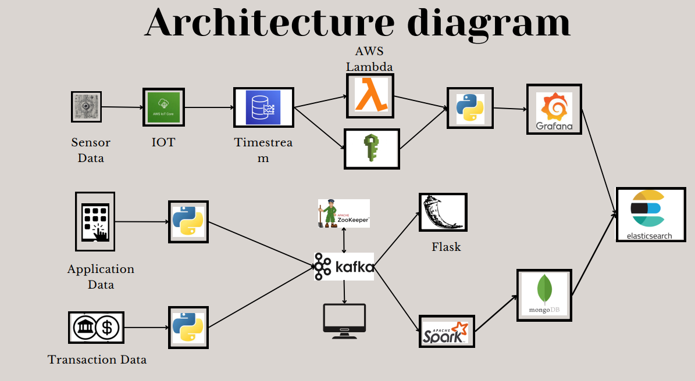

# Real-Time Smart Bank Data Streaming Capture using Big Data Processing

## 📌 Project Overview
This project implements a **real-time smart banking data streaming pipeline**, integrating **IoT, big data technologies, and real-time analytics** to process, store, and visualize transaction and sensor data efficiently. The architecture is designed to handle large-scale financial data streams, ensuring **low latency, scalability, and high availability**.

## 🏗️ Architecture Overview
The system ingests **sensor, application, and transaction data** through Confluent Kafka and AWS services, processes them using **Apache Spark**, and stores them in **MongoDB and Elasticsearch** for real-time querying and visualization. Key components include:
- **IoT Data Processing**: Captures sensor data via **AWS IoT Core** and streams it into **Amazon Timestream** for time-series analysis.
- **Transaction & Application Data Streaming**: Uses **Kafka & Zookeeper** to handle real-time streaming.
- **Data Processing & Storage**: 
  - **Apache Spark** processes transactional data for aggregation and fraud detection.
  - **MongoDB** for structured storage.
  - **Elasticsearch** for real-time search and analytics.
- **API Layer**: Flask-based REST APIs serve processed data.
- **Visualization & Monitoring**:
  - **Grafana** for monitoring system performance and sensor data.
  - **Elasticsearch Kibana Dashboards** for transaction and application data insights.

## Features & Capabilities
**Real-time Data Streaming** using Kafka & AWS Lambda  
**Big Data Processing** with Apache Spark  
**Time-Series Analysis** for IoT data using Amazon Timestream  
**Scalable Storage** with MongoDB & Elasticsearch  
**Live Monitoring & Visualization** with Grafana & Kibana  
**Secure API Endpoints** via Flask  

## 📌 Architecture Diagram


## How to Run This Project
To set up and run the pipeline locally:

```bash
# Clone the repository
git clone https://github.com/saivivek55/Real-Time-Smart-Bank-Data-Streaming-Capture_BigData.git
cd Real-Time-Smart-Bank-Data-Streaming-Capture_BigData

# Start Kafka & Zookeeper
bin/zookeeper-server-start.sh config/zookeeper.properties
bin/kafka-server-start.sh config/server.properties

# Run Apache Spark for Data Processing
spark-submit --master local[*] process_streaming.py

# Start Flask API
python app.py
```

🛠️ Tech Stack                                                                                                                                                                                                                                        
Big Data Technologies: Confluent Kafka, Apache Spark, Elasticsearch, MongoDB                                                                                                                                                                       
Cloud & IoT Services: AWS Lambda, AWS IoT Core, Amazon Timestream                                                                                                                                                                                          
Backend & API: Flask, Python 
Visualization & Monitoring: Grafana, Kibana                                                                                                                                                                                                                      

📄 License                                                                                                                                                                                                                                                    
This project is licensed under the Apache License 2.0 - see the LICENSE file for details.

## Dashboard Screenshot 1(Using Kibana):
  
## Dashboard Screenshot 2(Using Flask): 

